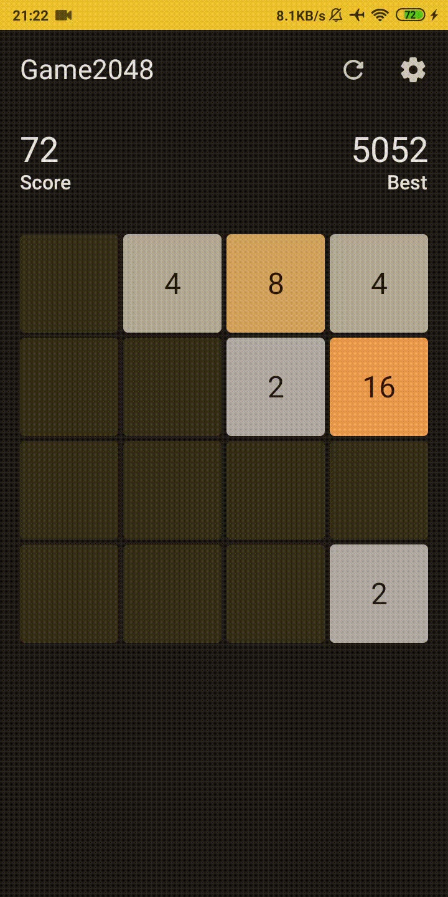

# Android 2048 Game in jetpack compose

A simple 2048 game written with 100% Jetpack Compose.

## Features
- Jetpack Compose
- Material 3
- MVVM
- Adaptable theme
- Datastore Preferences
- Multiple grid sizes

With material 3 (material you) from android 12, the app will adapt to your phone's background.
Grid items will automatically harmonize to the theme.

If you exit the game or want to continue later, all will be saved in datastore. So next time you open the app you have your last game played and your best score.

## Multiple grid sizes

Your can select multiple board grid sizes.
All sizes available:
- 3x3
- 4x4
- 5x5
- 6x6
- 7x7

The default grid size is 4x4, like from the the original game.

Thanks [@alexjlockwood](https://github.com/alexjlockwood) for the [Original project](https://github.com/alexjlockwood/android-2048-compose)